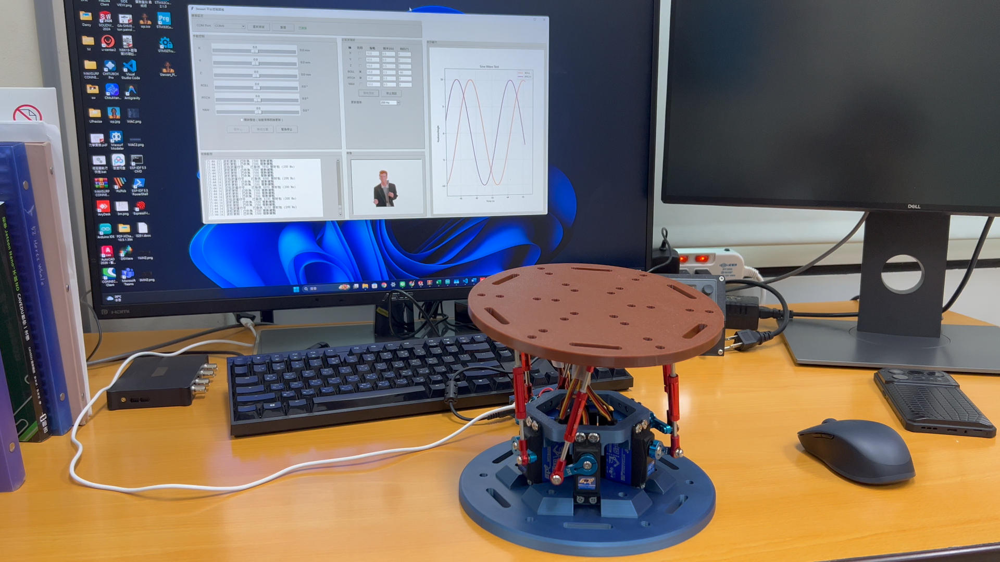
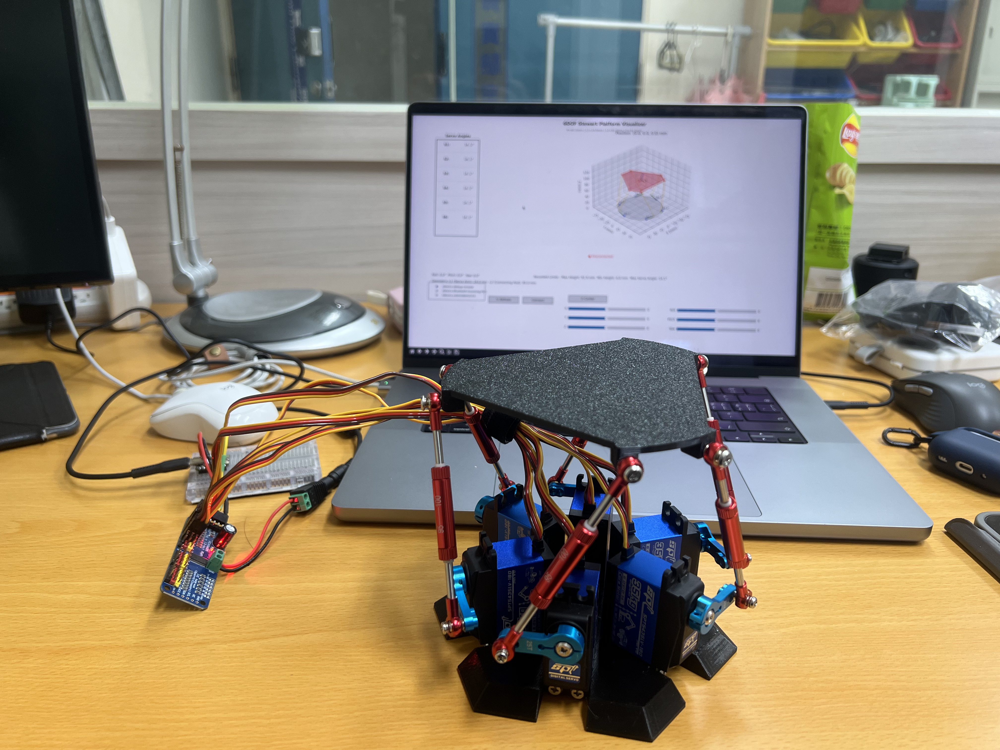
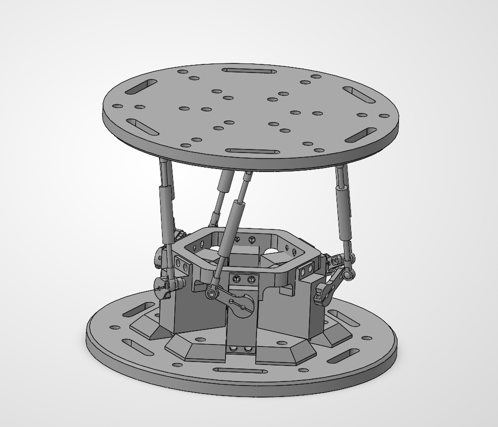
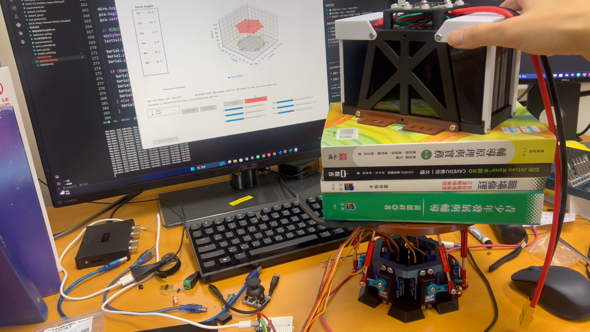
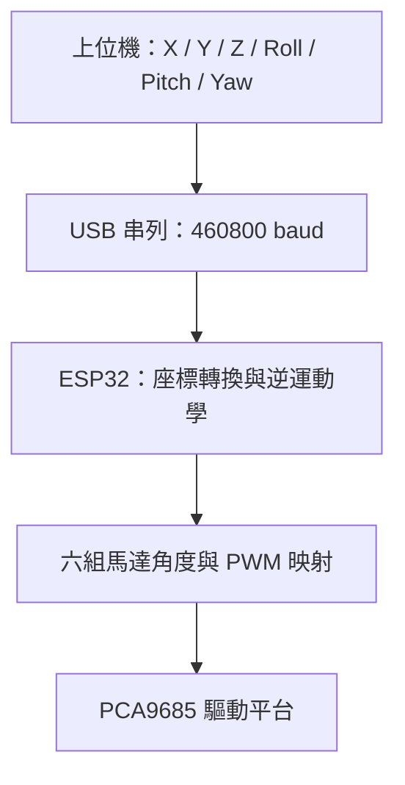

# 小型六自由度 Stewart 平台｜ESP32-C6 控制與 Python 上位機

**專案名稱：Mini-Stewart-Platform**

以 Python 上位機設定平台位置與姿態，由 ESP32-C6 計算逆運動學，再透過 PCA9685 控制六組伺服馬達。本專案涵蓋小型化機構設計、控制系統、上位機介面與實機測試。



**目前狀態：已完成實體組裝與運行測試。** 下方照片與影片展示平台實作及測試成果，本專案提供上位機程式、ESP32 韌體與機構模型，供學習與實作參考。

## 運行展示

- [二代運行影片（MP4）](docs/videos/v2-demo.mp4)
- [初代運行影片（MP4）](docs/videos/v1-demo.mp4)

影片提供 MP4 格式，可播放或下載。

## 開發歷程與個人貢獻

| 初代實機 | 二代實機 |
| --- | --- |
|  |  |

- **機構調整**：縮小平台機構，提供 STL、STEP 與 SolidWorks 設計檔。
- **控制系統**：ESP32／PCA9685 控制實作，後續版本將逆運動學移至 ESP32。
- **上位機修改**：提供六軸手動操作、各軸正弦波設定與命令波形顯示。
- **組裝與測試**：完成實體組裝及運動、負載測試；詳細測試條件與量測數據待補充。



### 負載測試紀錄



此照片記錄放置負載的測試情境。負載重量、持續時間、運動幅度及定位誤差尚未記錄於本專案，因此不據此宣稱最大承載量。另見 [運行照片](docs/images/v2-running.png)。

## 使用入口與目錄

本專案包含所需的上位機程式、ESP32 韌體與相依套件清單，可獨立安裝使用。

日常操作請執行根目錄的 `stewart_control_gui.py`，搭配 `firmware/ESP32C6_PCA/` 韌體。

```text
Mini-Stewart-Platform/
├── stewart_control_gui.py        # 主版本上位機
├── requirements.txt             # Python 相依套件
├── firmware/ESP32C6_PCA/
│   ├── ESP32C6_PCA.ino           # 主版本韌體
│   └── stewart_kinematics.h      # ESP32 逆運動學與幾何參數
├── GIF/Logo.gif                  # 介面標誌
├── docs/images/                  # 實機與模型照片
├── docs/videos/                  # 示範 MP4
├── models/                       # STL、STEP、SolidWorks
├── legacy/binary_pca9685/        # 舊版與二進位相容介面
├── README.md
├── LICENSE
└── .gitignore
```

主版本使用根目錄的上位機與 `firmware/`；`legacy/` 提供舊版程式作為參考。

## 主版本：上位機姿態命令 → ESP32 逆運動學



| 檔案 | 用途 |
| --- | --- |
| [stewart_control_gui.py](stewart_control_gui.py) | 新版 Python 上位機，傳送姿態 |
| [ESP32C6_PCA.ino](firmware/ESP32C6_PCA/ESP32C6_PCA.ino) | 接收姿態、驅動 PCA9685 |
| [stewart_kinematics.h](firmware/ESP32C6_PCA/stewart_kinematics.h) | ESP32 端幾何參數與逆運動學；須與 ino 放在同一資料夾 |

上位機負責輸入姿態與產生測試命令；ESP32 負責逆運動學與伺服輸出。測試範圍見 [測試與驗證](docs/VALIDATION.md)。

### 安裝上位機

在專案根目錄開啟 PowerShell：

```powershell
python -m venv .venv
.\.venv\Scripts\python.exe -m pip install -r requirements.txt
.\.venv\Scripts\python.exe stewart_control_gui.py
```

需具備 Tkinter 圖形環境。`Pillow` 用於圖片；`matplotlib` 用於波形顯示；`pyserial` 用於串列通訊。`numpy` 亦供保留的舊版視覺化使用。套件版本尚未鎖定。

選擇 ESP32 的 COM 埠並連線，同一埠勿同時由 Arduino 串列監控視窗占用。`GIF/Logo.gif` 用於介面標誌；可在 `GIF/` 放入其他 GIF 作為選用動畫。缺少 GIF 時程式仍可執行。

### 燒錄與硬體設定

1. 在 Arduino IDE 安裝支援實際 ESP32-C6 開發板的 Espressif ESP32 套件。
2. 安裝 `Adafruit PWM Servo Driver Library` 及其相依套件（包含 Adafruit BusIO）。
3. 開啟 `firmware/ESP32C6_PCA/ESP32C6_PCA.ino`；同目錄必須包含 `stewart_kinematics.h`。
4. 核對下列參數與實際機構後，再編譯及上傳。

| 項目 | 主版本程式設定 |
| --- | --- |
| SDA / SCL | GPIO22 / GPIO23 |
| PCA9685 位址 / 通道 | `0x40` / CH0～CH5 |
| 串列速率 | 460800 baud |
| 伺服 PWM 頻率 | **330 Hz**，須符合實際伺服規格 |
| 姿態單位 | 平移 mm、旋轉 degree |
| 底座／平台半徑 | 68 / 68 mm |
| 搖臂／連桿長度 | 24 / 99 mm |
| 中立平台高度 | **96.04 mm** |
| 通道反轉 | CH0、CH2、CH4 |
| 通道偏移 | 80、100、100、0、100、50 µs |
| 通訊逾時 | 1 秒未收到有效姿態，觸發韌體回中位處理 |

伺服電源依規格接 PCA9685 V+，ESP32 與 PCA9685 共地。邏輯 VCC 與 I2C 上拉應配合 ESP32 的 3.3 V 邏輯。韌體包含 PCA 輸出校正，數值針對原實機，不能直接當作其他硬體的量測結果。

### 通訊配對

主版本格式（每包以換行結束）：

```text
$P,x,y,z,roll,pitch,yaw,checksum
```

上位機將數值格式化為小數兩位；checksum 為各值乘 10 後逐項截斷為整數、加總再取低 8 位。`$V,0` 關閉詳細回應、`$V,1` 開啟。韌體使用單精度浮點，上位機使用 Python 浮點，校驗在小數邊界仍需實測確認。

GUI 波形顯示的是命令值，並非感測器量測的平台實際姿態。原介面「緊急停止」的程式行為為停止測試並送出回中心命令，不是切斷馬達電源。手動送出單一命令後若未持續更新，韌體可能於 1 秒後回中位。

## 舊版與相容版

| 版本 | 上位機入口（相對專案根目錄） | 配對韌體 | 通訊格式 |
| --- | --- | --- | --- |
| 主版本 | `stewart_control_gui.py` | `firmware/ESP32C6_PCA/ESP32C6_PCA.ino` | 460800 baud、`$P` 姿態封包 |
| 舊版／相容版 | `legacy/binary_pca9685/6dof_visualizer.py` 或同目錄的 `stewart_control_gui.py` | 該目錄下的 `esp32c6_pca9685_receiver/esp32c6_pca9685_receiver.ino` | 115200 baud、12-byte 角度封包 |

兩個目錄中的上位機使用不同協定，請依表格搭配韌體。

[legacy/binary_pca9685](legacy/binary_pca9685/README.md) 提供 3D 視覺化與 PC 逆運動學相容介面，使用 **115200 baud、12-byte 角度封包**，須搭配該目錄自己的接收器。不要與主版本韌體混用。

## 3D 模型

見 [模型說明](models/README.md)：

- [STL](models/stl/)：列印零件。
- [STEP](models/step/)：組合件交換格式。
- [SolidWorks](models/solidworks/)：組合件與原生零件檔。

開啟 SolidWorks 組合件時請保留零件檔的相對位置；列印前請核對尺寸、配合間隙與材料設定。

## 測試與驗證

實機展示、軟體測試範圍及重現方式見 [測試與驗證](docs/VALIDATION.md)。使用原始碼的安裝方式請參考上方步驟。

## AI 協作說明

本專案使用 OpenAI Codex 協助文件撰寫、程式檢查與部分程式開發。

機構縮小、硬體組裝與實機測試由專案作者完成。實機照片與影片為實際成果紀錄，並非 AI 生成。AI 執行的軟體檢查不等同於硬體驗證，各項測試範圍見 [測試與驗證](docs/VALIDATION.md)。

## 來源與授權

本專案基於 [knaufinator/6DOF-Rotary-Stewart-Motion-Simulator](https://github.com/knaufinator/6DOF-Rotary-Stewart-Motion-Simulator) 進行小型化與控制系統實作，保留原有 [LICENSE](LICENSE) 與 Chris Knauf 署名。

數學推導可參考 Robert Eisele（2019）的 [Inverse Kinematics of a Stewart Platform](https://raw.org/research/inverse-kinematics-of-a-stewart-platform/)。
